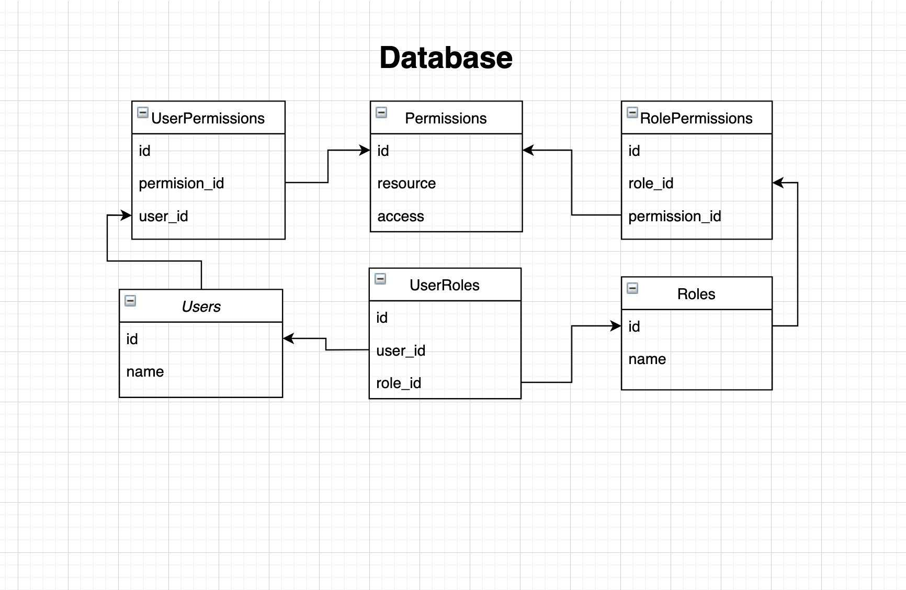

REQUIREMENTS

You need to design a programming module PERMISSIONS that would allow Caller to

1.  Grant a permission to a user
2.  Check if a user has a particular permission

Caller is an external system that uses our module (particularly it calls our API).

Permission is a user right to take an action or access a resource. Permissions for resource access can be READ or WRITE. For example, Caller can grant a permission ”reboot the server” (an example of action) OR write to a file “C:/readme.txt” (an example of resource) to a user Andrew.

Caller can grant permissions directly to a user OR via roles. If Caller wants to grant permissions via roles then Caller needs to register a role, grant permissions to the role and then assign the role to a user.

Caller can assign many roles to a user.

As a note, our module (you are designing) doesn’t provide any dictionaries to Caller. All objects (including Users) are created / managed by Caller. Our module provides ONLY functionality.
OUTCOME
NOTE: You don’t have to strictly use a specific programming language for the exercise. You can use just a meta syntax that would give us an idea of your solution - we’re not going to compile it for sure :).

We would expect you to write module API (a list of functions with parameters) and design a database for the module. A list of functions can look like this (this is ONLY an example and companies and employees have nothing to do with this exercise):

```
function AddEmployee(company, first\_name, last\_name, age): boolean;
function AddJob(company, first\_name, last\_name, age): boolean;
function IsEmployeeFired(employeeId): boolean;
...
```
If you want to pass an object as a parameter you can describe an object separately:
```
Class Company {
String name;
String address;
Integer taxId;
}
```
Database design can be presented as a list of tables with most important fields (no need to define indexes, etc). For example,
```
Table Companies {
Id,
Name,
Address,
TaxId
}
```

```
Table Employees {
Id,
CompanyId, // this is a foreign key to Company
FirstName,
LastName,
Job
}
```


```ruby
require 'redcarpet'
markdown = Redcarpet.new("Hello World!")
puts markdown.to_html
```


# TASK SOLUTION

## module API (a list of functions with parameters)
```ruby
class UserPermissionController
	function addUserPermission(userId, permissionId)
	function getUserPermissions(userId)
	function deleteUserPermission(userId, permissionId)
end

class PermissionController
	function createPermission(access, resource)
	function getPermissions()
	function getPermission(permissionId)
	function updatePermission(permissionId, access, resource)
	function destroyPermission(permissionId)
end

class RolePermissionController
	function addRolePermission(roleId, permissionId)
	function getRolePermissions(roleId)
	function deleteRolePermission(roleId, permissionId)
end

class RoleController
	function addUserRole(userId, roleId)
	function getUserRoles(userId)
	function deleteUserRole(userId, roleId)
end

class UserController
	function createUser(name, [permissionIds], [roleIds])
	function getUser(userId)
	function getUsers()
	function updateUser(userId, name)
	function destroyUser(userId)
	function permissionGrantedToUser(userId, permissionId)
end

class UserRoleController
	function createRole(name, [permissionIds])
	function getRole(roleId)
	function getRoles()
	function updateRole(roleId, name, [permissionIds])
	function destroyRole(roleId)
end
```


## Database



##  Structure of the class
```ruby
class Permission
	String access
	String resource
end

class User 
	String name
	Array Permission
	Array Role
end

class Role 
	String name
	Array Permission
end
```

